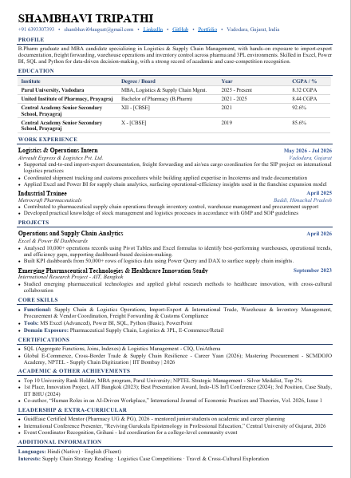

# 👩‍💼 Shambhavi Tripathi - Resume & Portfolio

## 📌 About Me

I am a **B.Pharm graduate and MBA candidate specializing in Logistics & Supply Chain Management**, with hands-on exposure to import-export documentation, freight forwarding, warehouse operations, inventory control, procurement, and supply chain analytics.

I use **Excel, Power BI, SQL, and Python** to analyze data and support data-driven decision-making.

---

## 🎓 Education

| Institute                               | Degree                                    | Year         |  CGPA / % |
| --------------------------------------- | ----------------------------------------- | ------------ | --------: |
| Parul University, Vadodara              | MBA – Logistics & Supply Chain Management | 2025–Present | 8.32 CGPA |
| United Institute of Pharmacy, Prayagraj | Bachelor of Pharmacy                      | 2021–2025    | 8.44 CGPA |
| Central Academy Senior Secondary School | XII – CBSE                                | 2021         |     92.6% |
| Central Academy Senior Secondary School | X – CBSE                                  | 2019         |     85.6% |

---

## 💼 Work Experience

### Logistics & Operations Intern

**Airvault Express & Logistics Pvt. Ltd. — Vadodara, Gujarat**
*May 2026 – July 2026*

* Supported end-to-end import-export documentation and freight forwarding.
* Assisted with air and sea cargo coordination.
* Coordinated shipment tracking and customs procedures.
* Developed practical knowledge of Incoterms and trade documentation.
* Applied Excel and Power BI for supply chain analytics.
* Worked on operational-efficiency insights for a franchise expansion model.

### Industrial Trainee

**Metrocraft Pharmaceuticals — Baddi, Himachal Pradesh**
*April 2025*

* Supported inventory control, warehouse management, and procurement activities.
* Developed practical knowledge of stock management and logistics processes.
* Worked according to GMP and SOP guidelines.

---

## 📊 Projects

### Operations & Supply Chain Analytics

**Excel & Power BI Dashboards — April 2026**

* Analyzed **10,000+ operations records** using Pivot Tables and Excel formulas.
* Identified warehouse performance, operational trends, and efficiency gaps.
* Built KPI dashboards using **50,000+ rows of logistics data**.
* Used Power Query and DAX to generate supply chain insights.

### Emerging Pharmaceutical Technologies & Healthcare Innovation Study

**International Research Project — AIT, Bangkok**

* Studied emerging pharmaceutical technologies.
* Applied global research methods to healthcare innovation.
* Collaborated in a cross-cultural international environment.

---

## 🛠️ Core Skills

### Functional Skills

* Supply Chain & Logistics Operations
* Import-Export & International Trade
* Warehouse & Inventory Management
* Procurement & Vendor Coordination
* Freight Forwarding
* Customs Compliance

### Technical Skills

* **MS Excel – Advanced**
* **Power BI**
* **SQL**
* **Python – Basic**
* **PowerPoint**

### Domain Exposure

* Pharmaceutical Supply Chain
* Logistics & 3PL
* E-Commerce / Retail

---

## 📜 Certifications

* SQL – Aggregate Functions, Joins & Indexes
* Logistics Management – CIQ, UniAthena
* Global E-Commerce, Cross-Border Trade & Supply Chain Resilience
* Mastering Procurement – SCMDOJO Academy
* NPTEL – Supply Chain Digitization, IIT Bombay, 2026

---

## 🏆 Achievements

* 🥇 Top 10 University Rank Holder – MBA, Parul University
* 🥈 NPTEL Strategic Management – Silver Medalist, Top 2%
* 🥇 1st Place – Innovation Project, AIT Bangkok
* 🏆 Best Presentation Award – Indo-US International Conference
* 🥉 3rd Position – Case Study, IIT BHU
* 📚 Co-author of **“Human Roles in an AI-Driven Workplace”** in the *International Journal of Economic Practices and Theories*.

---

## 👑 Leadership & Extra-Curricular

* **GuidEase Certified Mentor** – mentored junior students on academic and career planning.
* **International Conference Presenter** – presented research on *Reviving Gurukula Epistemology in Professional Education*.
* **Event Coordinator Recognition** – coordinated a college-level community event.

---

## 📂 Portfolio Structure

```text
Shambhavi-Tripathi-Resume-Portfolio/
│
├── README.md
├── Resume/
│   └── Shambhavi_Tripathi_Resume.pdf
│
├── Projects/
│   ├── Excel-Dashboards/
│   ├── PowerBI-Dashboards/
│   ├── SQL-Projects/
│   └── Supply-Chain-Analytics/
│
└── Certifications/
```

---

### 📄 Resume Preview

## 🖥️ Resume Preview

<p align="center">
  <a href="Resume/Shambhavi_Tripathi_Resume.pdf">
    
  </a>
</p>

<p align="center">
  <b>Click the preview above to view the complete resume.</b>
</p>

---

## 🎯 Career Interests

Interested in opportunities across:

* Supply Chain Management
* Logistics Operations
* Procurement
* Vendor Management
* Freight Forwarding
* Import-Export Operations
* Warehouse & Inventory Management
* Supply Chain Analytics
* Business/Data Analytics

---

## 📫 Contact

**Shambhavi Tripathi**

📍 Vadodara, Gujarat, India
📞 +91 6393307393
📧 [shambhavi04august@gmail.com](mailto:shambhavi04august@gmail.com)

🔗 LinkedIn | GitHub | Portfolio

---

## ⭐ Portfolio

This repository serves as a central portfolio showcasing my **academic projects, supply chain analytics work, dashboards, technical skills, certifications, and professional experience**.

⭐ If you find my work interesting, consider starring this repository!
